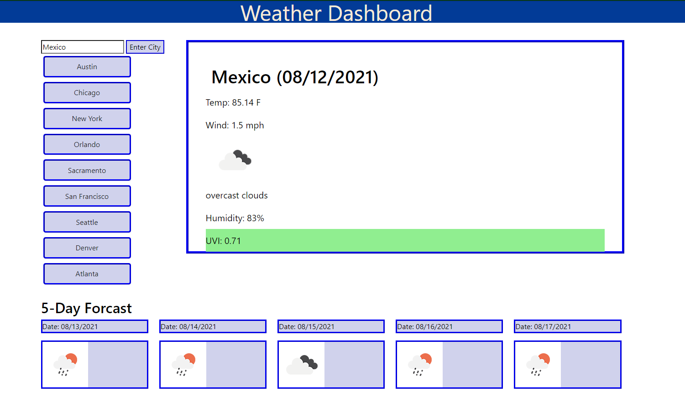

# weatherDashboard
The Weather Dashboard shows a default city, then when the user enters the city name that they want to see or click on one of the city button, the weather data for that city and it's 5 day forcast will be displayed.  The UV Index will be colored depending on the UV rating for the city: green is good, orange is be careful and pink is stay inside.

## User Story

```
AS A traveler
I WANT to see the weather outlook for multiple cities
SO THAT I can plan a trip accordingly
```

## Acceptance Criteria

```
all the following criteria has been met.
GIVEN a weather dashboard with form inputs
WHEN I search for a city
    THEN I am presented with current and future conditions for that city and that city is added to the search history
WHEN I view current weather conditions for that city
    THEN I am presented with the city name, the date, an icon representation of weather conditions, the temperature, the humidity, the wind speed, and the UV index
WHEN I view the UV index
    THEN I am presented with a color that indicates whether the conditions are favorable, moderate, or severe
WHEN I view future weather conditions for that city
    THEN I am presented with a 5-day forecast that displays the date, an icon representation of weather conditions, the temperature, the wind speed, and the humidity
WHEN I click on a city in the search history
    THEN I am again presented with current and future conditions for that city
```
### link to page:   https://ljbrewer.github.io/weatherDashboard/


### Link to GitHub repository: https://github.com/ljbrewer/weatherDashboard


### picture of Webpage:

